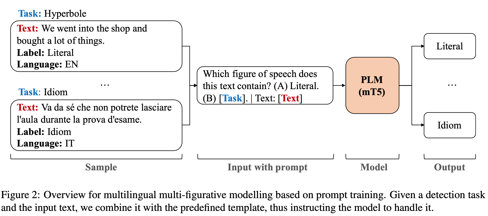

# [Multilingual Multi-Figurative Language Detection (ACL 2023 Findings)](https://arxiv.org/abs/2306.00121)

> **Abstract:** 
Figures of speech help people express abstract concepts and evoke stronger emotions than literal expressions, thereby making texts more creative and engaging. Due to its pervasive and fundamental character, figurative language understanding has been addressed in Natural Language Processing, but it's highly understudied in a multilingual setting and when considering more than one figure of speech at the same time. To bridge this gap, we introduce multilingual multi-figurative language modelling, and provide a benchmark for sentence-level figurative language detection, covering three common figures of speech and seven languages. Specifically, we develop a framework for figurative language detection based on template-based prompt learning. In so doing, we unify multiple detection tasks that are interrelated across multiple figures of speech and languages, without requiring task- or language-specific modules. Experimental results show that our framework outperforms several strong baselines and may serve as a blueprint for the joint modelling of other interrelated tasks.

## Overview



## Quick Start

### How to use

```python
from transformers import MT5TokenizerFast, MT5ForConditionalGeneration
tokenizer = MT5TokenizerFast.from_pretrained('laihuiyuan/MMFLD')
model = MT5ForConditionalGeneration.from_pretrained('laihuiyuan/MMFLD')

prompt = 'Which figure of speech does this text contain? (A) Literal. (B) {}. | Text: {}'
task = 'Idiom' # Hyperbole and Metaphor are also supported
text = 'This is a perfect way to break the ice and start the conversation.'

inputs = prompt.format(task, text)
inputs = tokenizer(inputs, return_tensors="pt")
output = model.generate(**inputs)
pred = tokenizer.decode(output[0].tolist(), skip_special_tokens=True, clean_up_tokenization_spaces=False)
```

### Train model
```
python mt5_ft.py 
    -lang en_XX zh_CN de_DE es_XX it_IT fa_IR ru_RU \
    -form hyperbole idiom metaphor \
    -prompt 'Which figure of speech does this text contain? (A) Literal. (B) {}. | Text: '
```

## Citation
If you use this code, please cite our paper:
```
@inproceedings{lai-etal-2023-multi,
    title = "Multilingual Multi-Figurative Language Detection",
    author = "Lai, Huiyuan and Toral, Antonio and Nissim, Malvina",
    booktitle = "Findings of the Association for Computational Linguistics: ACL 2023",
    month = July,
    year = "2023",
    address = "Toronto, Canada",
    publisher = "Association for Computational Linguistics",
}
```